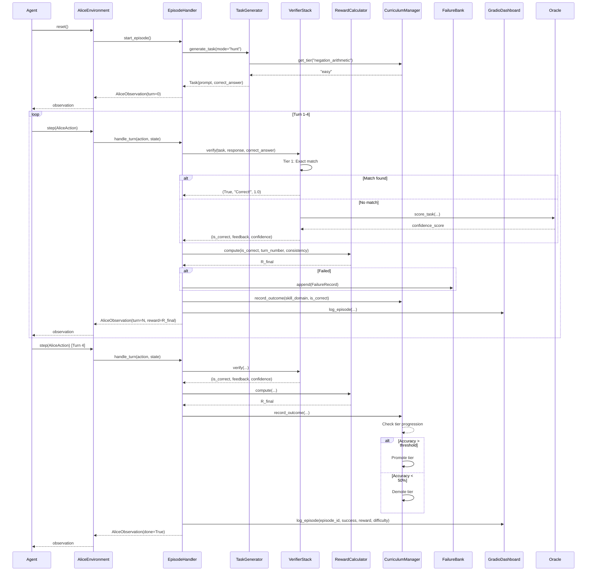
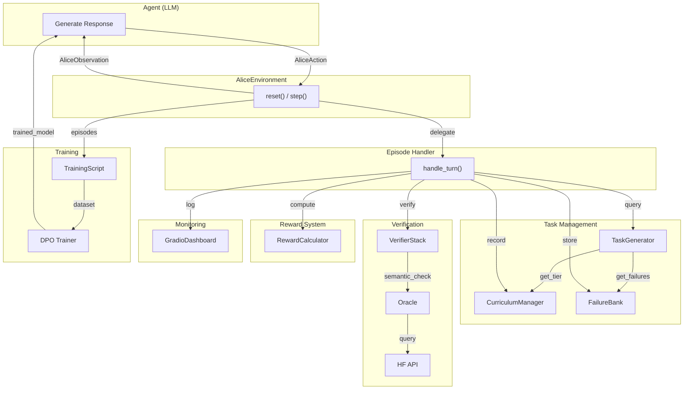
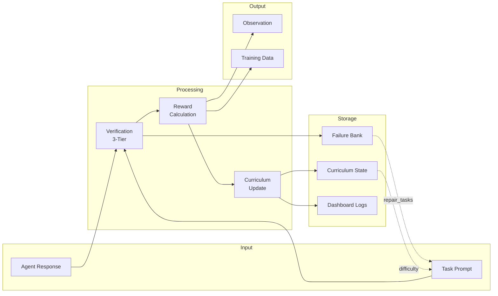
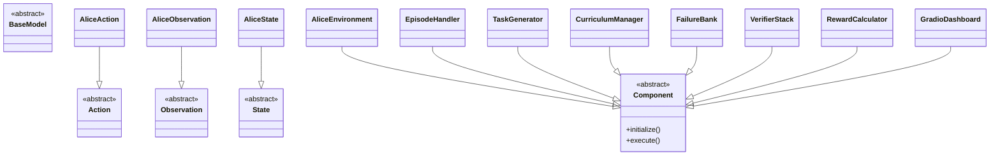

# ALICE UML Diagram

## Class Diagram

```mermaid
classDiagram
    %% Data Models
    class AliceAction {
        +String response
        +String mode
        +String task_id
    }

    class AliceObservation {
        +String task
        +String skill_domain
        +String difficulty_tier
        +int turn_number
        +String hint
        +float reward
        +bool done
        +String feedback
        +String task_id
    }

    class AliceState {
        +String episode_id
        +int step_count
        +String current_task
        +int turn_number
        +List attempt_history
        +String skill_domain
        +String difficulty_tier
        +String mode
        +int failure_bank_size
        +String task_id
        +String correct_answer
        +String hint
        +bool done
    }

    class Task {
        +String prompt
        +String correct_answer
        +String skill_domain
        +String difficulty_tier
    }

    class FailureRecord {
        +String task
        +String agent_response
        +String correct_answer
        +String timestamp
        +String skill_domain
        +String difficulty_tier
    }

    %% Core Environment
    class AliceEnvironment {
        -AliceState state
        -EpisodeHandler episode_handler
        -TaskGenerator task_generator
        -CurriculumManager curriculum_manager
        -FailureBank failure_bank
        -RewardCalculator reward_calculator
        -VerifierStack verifier_stack
        -GradioDashboard dashboard
        +reset() AliceObservation
        +step(action: AliceAction) AliceObservation
    }

    class EpisodeHandler {
        -AliceState state
        -TaskGenerator task_generator
        -VerifierStack verifier_stack
        -RewardCalculator reward_calculator
        -CurriculumManager curriculum_manager
        -FailureBank failure_bank
        -GradioDashboard dashboard
        +start_episode() AliceState
        +handle_turn(action: AliceAction, state: AliceState) AliceObservation
        -_turn_1(action: AliceAction, state: AliceState) AliceObservation
    }

    %% Task Management
    class TaskGenerator {
        -FailureBank failure_bank
        -Oracle oracle
        -CurriculumManager curriculum_manager
        +generate_task(mode: String) Task
        +_generate_hunt_task() Task
        +_generate_repair_task() Task
    }

    class Task {
        +String prompt
        +String correct_answer
    }

    %% Curriculum & Tracking
    class CurriculumManager {
        -Dict curriculum_state
        -String state_path
        +record_outcome(skill_domain: String, correct: bool) void
        +get_tier(skill_domain: String) String
        +get_accuracy(skill_domain: String) float
        -_load() void
        -_save() void
    }

    class FailureBank {
        -List records
        -String path
        +append(record: FailureRecord) void
        +get_random() FailureRecord
        +size() int
        -_load() void
    }

    %% Verification
    class VerifierStack {
        -Oracle oracle
        +verify(task: String, response: String, correct_answer: String) Tuple
        -_tier_1_exact_match(response: String, correct_answer: String) Tuple
        -_tier_2_semantic(task: String, response: String, correct_answer: String) Tuple
        -_tier_3_consistency(response: String, history: List) Tuple
    }

    class Oracle {
        -String api_base_url
        -String model_name
        -String hf_token
        +score_task(task: String, response: String, correct_answer: String) float
        -_query_model(model_name: String, prompt: String) String
        -_compute_pass_rate(results: List) float
    }

    %% Reward
    class RewardCalculator {
        +compute(is_correct: bool, turn_number: int, consistency: float) float
        +decompose(is_correct: bool, turn_number: int, consistency: float) Dict
        -_compute_r_task(is_correct: bool, turn_number: int) float
        -_compute_r_efficiency(turn_number: int) float
        -_compute_r_consistency(consistency: float) float
    }

    %% Monitoring
    class GradioDashboard {
        +log_episode(episode_id: String, success: bool, reward: float, difficulty: String) void
        +get_dashboard_data() Dict
    }

    %% Relationships
    AliceEnvironment --> EpisodeHandler : uses
    AliceEnvironment --> TaskGenerator : uses
    AliceEnvironment --> CurriculumManager : uses
    AliceEnvironment --> FailureBank : uses
    AliceEnvironment --> RewardCalculator : uses
    AliceEnvironment --> VerifierStack : uses
    AliceEnvironment --> GradioDashboard : uses

    EpisodeHandler --> TaskGenerator : queries
    EpisodeHandler --> VerifierStack : uses
    EpisodeHandler --> RewardCalculator : uses
    EpisodeHandler --> CurriculumManager : updates
    EpisodeHandler --> FailureBank : records
    EpisodeHandler --> GradioDashboard : logs

    TaskGenerator --> FailureBank : queries
    TaskGenerator --> CurriculumManager : queries
    TaskGenerator --> Oracle : uses

    VerifierStack --> Oracle : uses

    AliceAction --|> AliceObservation : input/output
    AliceState --|> AliceObservation : internal state
    Task --|> TaskGenerator : produces
    FailureRecord --|> FailureBank : stores
```

## Sequence Diagram - Single Episode

```mermaid
sequenceDiagram
    participant Agent
    participant Env as AliceEnvironment
    participant EH as EpisodeHandler
    participant TG as TaskGenerator
    participant VS as VerifierStack
    participant RC as RewardCalculator
    participant CM as CurriculumManager
    participant FB as FailureBank
    participant GD as GradioDashboard

    Agent->>Env: reset()
    Env->>EH: start_episode()
    EH->>TG: generate_task(mode="hunt")
    TG->>CM: get_tier("negation_arithmetic")
    CM-->>TG: "easy"
    TG-->>EH: Task(prompt, correct_answer)
    EH-->>Env: AliceObservation(turn=0)
    Env-->>Agent: observation

    loop Turn 1-4
        Agent->>Env: step(AliceAction)
        Env->>EH: handle_turn(action, state)
        EH->>VS: verify(task, response, correct_answer)
        VS->>VS: Tier 1: Exact match
        alt Match found
            VS-->>EH: (True, "Correct!", 1.0)
        else No match
            VS->>Oracle: score_task(...)
            Oracle-->>VS: confidence_score
            VS-->>EH: (is_correct, feedback, confidence)
        end
        EH->>RC: compute(is_correct, turn_number, consistency)
        RC-->>EH: R_final
        alt Failed
            EH->>FB: append(FailureRecord)
        end
        EH->>CM: record_outcome(skill_domain, is_correct)
        EH->>GD: log_episode(...)
        EH-->>Env: AliceObservation(turn=N, reward=R_final)
        Env-->>Agent: observation
    end

    Agent->>Env: step(AliceAction) [Turn 4]
    Env->>EH: handle_turn(action, state)
    EH->>VS: verify(...)
    VS-->>EH: (is_correct, feedback, confidence)
    EH->>RC: compute(...)
    RC-->>EH: R_final
    EH->>CM: record_outcome(...)
    CM-->>CM: Check tier progression
    alt Accuracy > threshold
        CM->>CM: Promote tier
    else Accuracy < 50%
        CM->>CM: Demote tier
    end
    EH->>GD: log_episode(episode_id, success, reward, difficulty)
    EH-->>Env: AliceObservation(done=True)
    Env-->>Agent: observation
```

## Component Interaction Diagram

```mermaid
graph TB
    subgraph Agent["Agent (LLM)"]
        A["Generate Response"]
    end
    
    subgraph Environment["AliceEnvironment"]
        E["reset() / step()"]
    end
    
    subgraph EpisodeLogic["Episode Handler"]
        EH["handle_turn()"]
    end
    
    subgraph TaskMgmt["Task Management"]
        TG["TaskGenerator"]
        CM["CurriculumManager"]
        FB["FailureBank"]
    end
    
    subgraph Verification["Verification"]
        VS["VerifierStack"]
        O["Oracle"]
        HF["HF API"]
    end
    
    subgraph Reward["Reward System"]
        RC["RewardCalculator"]
    end
    
    subgraph Monitoring["Monitoring"]
        GD["GradioDashboard"]
    end
    
    subgraph Training["Training"]
        TS["TrainingScript"]
        DPO["DPO Trainer"]
    end
    
    A -->|AliceAction| E
    E -->|AliceObservation| A
    E -->|delegate| EH
    
    EH -->|query| TG
    TG -->|get_tier| CM
    TG -->|get_failures| FB
    
    EH -->|verify| VS
    VS -->|semantic_check| O
    O -->|query| HF
    
    EH -->|compute| RC
    EH -->|record| CM
    EH -->|store| FB
    EH -->|log| GD
    
    E -->|episodes| TS
    TS -->|dataset| DPO
    DPO -->|trained_model| A
```

## Data Flow Diagram

```mermaid
graph LR
    subgraph Input["Input"]
        I1["Agent Response"]
        I2["Task Prompt"]
    end
    
    subgraph Processing["Processing"]
        P1["Verification<br/>3-Tier"]
        P2["Reward<br/>Calculation"]
        P3["Curriculum<br/>Update"]
    end
    
    subgraph Storage["Storage"]
        S1["Failure Bank"]
        S2["Curriculum State"]
        S3["Dashboard Logs"]
    end
    
    subgraph Output["Output"]
        O1["Observation"]
        O2["Training Data"]
    end
    
    I1 --> P1
    I2 --> P1
    P1 --> P2
    P2 --> P3
    
    P1 --> S1
    P3 --> S2
    P3 --> S3
    
    P2 --> O1
    P2 --> O2
    
    S1 -.->|repair_tasks| I2
    S2 -.->|difficulty| I2
```

## Class Hierarchy

```mermaid
classDiagram
    class BaseModel {
        <<abstract>>
    }
    
    class Action {
        <<abstract>>
    }
    
    class Observation {
        <<abstract>>
    }
    
    class State {
        <<abstract>>
    }
    
    AliceAction --|> Action
    AliceObservation --|> Observation
    AliceState --|> State
    
    class Component {
        <<abstract>>
        +initialize()
        +execute()
    }
    
    AliceEnvironment --|> Component
    EpisodeHandler --|> Component
    TaskGenerator --|> Component
    CurriculumManager --|> Component
    FailureBank --|> Component
    VerifierStack --|> Component
    RewardCalculator --|> Component
    GradioDashboard --|> Component
```
