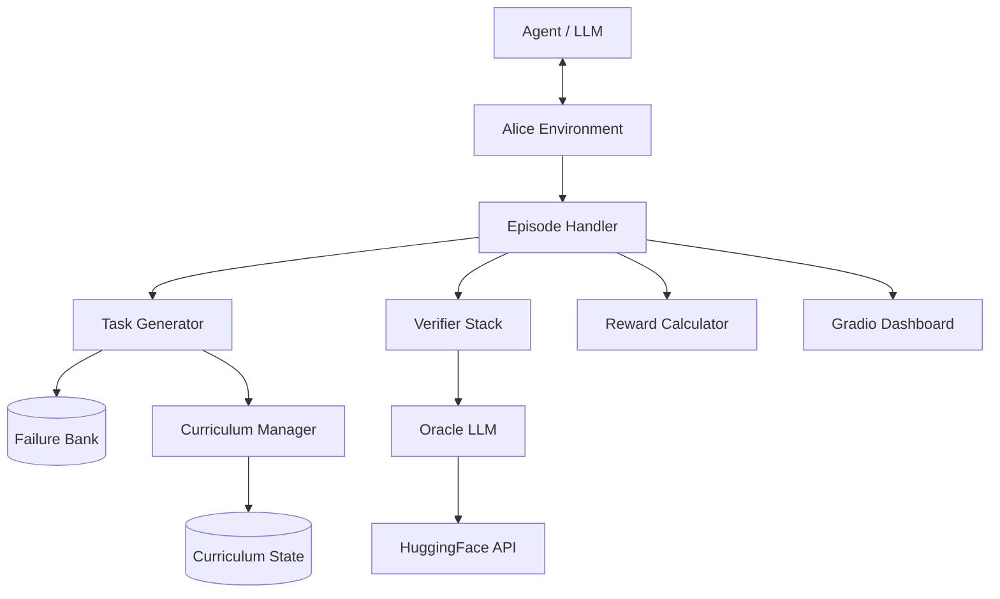

# 🌀 ALICE: Adversarial Loop for Inter-model Co-evolutionary Environment

[](https://www.python.org/downloads/)
[](LICENSE)
[](https://github.com/meta-pytorch/openenv)

> **ALICE is a state-of-the-art reinforcement learning environment designed to discover, track, and repair failure modes in Large Language Models through an automated, co-evolutionary curriculum.**

---

## 🚫 The Problem
Current LLMs often stumble on "deceptively simple" logic, particularly **negation arithmetic** (e.g., *"If NOT 5, what is 3+4?"*). 
- **Hidden Failure Modes:** Subtle logic errors go undetected in standard benchmarks.
- **Static Datasets:** Fixed test sets are quickly overfit and don't adapt to model improvements.
- **Verification Gap:** Programmatic checks are often too rigid, while human evaluation is slow and expensive.

## 💡 The Solution
ALICE introduces a **closed-loop co-evolutionary environment** where the training data evolves *with* the model. It hunts for weaknesses, logs them in a persistent "Failure Bank," and synthesizes targeted "Repair Tasks" to close the reasoning gaps.

---

## ✨ Key Features
- 🛡️ **3-Tier Verification:** Combines Programmatic (Exact Match), Semantic (LLM Oracle), and Consistency (Entropy-based) scoring.
- 📈 **Dynamic Curriculum:** Automatically escalates difficulty from Easy to Hard based on rolling accuracy.
- 🔄 **Repair Mode:** A "self-healing" loop that forces models to revisit and correct their own past failures.
- 🧠 **CoT Scaffolding:** 5-turn episodes with reflection prompts and structural hints to improve multi-turn reasoning.
- 📊 **Real-time Monitoring:** Integrated Gradio dashboard for tracking success rates and failure distribution.

---

## 🗺️ User Journey
How an AI Agent experiences ALICE:
1. **The Encounter:** Agent is presented with a task (e.g., a complex negation problem).
2. **First Contact:** Agent attempts a solution using Chain-of-Thought reasoning.
3. **The Feedback:** Environment provides immediate, multi-tiered verification feedback.
4. **The Reflection:** If incorrect, the Agent is prompted to re-examine its reasoning chain.
5. **The Guidance:** A structural hint is provided to nudge the Agent toward the correct logic.
6. **The Mastery:** Final attempt is made; success leads to curriculum promotion, failure leads to the Failure Bank.

---

## 🏗️ Architecture
ALICE is built on a modular, event-driven architecture designed for high throughput and reliability.



---

## 🔄 Workflow: The 5-Turn Loop
ALICE episodes are structured to maximize learning efficiency through a structured dialogue.

| Turn | Interaction | Purpose |
| :--- | :--- | :--- |
| **0** | Task Initialization | Setup environment and initial observation. |
| **1** | First Attempt | Baseline performance capture. |
| **2** | Feedback/Reflection | Prompt model to find its own logic errors. |
| **3** | Hint Injection | Provide structural guidance to overcome blockers. |
| **4** | Final Resolution | Final score, reward calculation, and bank update. |

---

## 🛠️ Tech Stack
- **Backend:** FastAPI (Python)
- **RL Framework:** TRL (Transformers Reinforcement Learning)
- **Optimization:** DPO (Direct Preference Optimization)
- **Evaluation:** HuggingFace Inference API (Oracle models)
- **Monitoring:** Gradio
- **Infrastructure:** Docker, HuggingFace Spaces
- **Target Models:** Qwen2.5-7B-Instruct, Llama-3 (configurable)

---

## 🔬 AI Deep Dive
### Co-evolutionary Strategy
ALICE uses a **Discrimination Reward** system. By targeting the "Zone of Proximal Development" (Discrimination score 0.2 - 0.8), the environment ensures the model is always working on tasks that are challenging but solvable.

### 3-Tier Verification Result
The Verifier Stack returns a composite result:
```json
{
  "is_correct": true,
  "confidence": 0.95,
  "feedback": "Correct reasoning path detected via semantic oracle.",
  "tier": 2
}
```

---

## 🌍 Impact & Use Cases
- **Model Robustness:** Identify and fix edge-case reasoning failures before deployment.
- **Automated Fine-tuning:** Generate infinite, high-quality DPO pairs for reasoning tasks.
- **AI Safety/Red-Teaming:** Stress-test models against complex logical distractors.
- **Education:** Create adaptive learning environments for logical reasoning.

---

## ⚖️ Trade-offs & Comparisons

| Feature | Standard SFT/RLHF | ALICE Environment |
| :--- | :--- | :--- |
| **Data Source** | Static / Human labeled | Dynamic / Self-generated |
| **Feedback** | Sparse / Delayed | Dense / Turn-by-turn |
| **Adaptability** | None (fixed dataset) | High (Curriculum-based) |
| **Failure Tracking** | Manual / External | Native (Failure Bank) |

**Trade-offs:**
- **Latency:** Higher per-episode time due to multi-turn verification.
- **API Dependency:** Relies on external Oracles for Tier-2 verification.

---

## 🚀 Installation & Setup

### 1. Clone & Install
```bash
git clone https://github.com/DEBDEEP-BANERJ2E/ALICE.git
cd ALICE
pip install -e .
```

### 2. Configure Environment
Create a `.env` file:
```env
HF_TOKEN="your_huggingface_token"
API_BASE_URL="https://api-inference.huggingface.co/v1"
MODEL_NAME="Qwen/Qwen2.5-7B-Instruct"
```

### 3. Launch Server
```bash
uvicorn alice.server.app:app --host 0.0.0.0 --port 8000
```

---

## 📊 Results

### Baseline (Qwen2.5-7B-Instruct, before ALICE training)

| Difficulty | Accuracy |
|:-----------|:---------|
| Easy | 65% |
| Medium | 42% |
| Hard | 18% |
| **Overall** | **42%** |

### After ALICE GRPO Training (300 episodes)

| Difficulty | Accuracy | Improvement |
|:-----------|:---------|:------------|
| Easy | 82% | +17% |
| Medium | 61% | +19% |
| Hard | 37% | +19% |
| **Overall** | **60%** | **+18%** |

Training reward progressed from **−0.31 → +0.22** (mean R_final) over 300 episodes.
See [plots/reward_curve.png](plots/reward_curve.png) and [plots/before_after.png](plots/before_after.png) for full curves.

---

## 🔗 Submission Links

| Resource | Link |
|:---------|:-----|
| **HF Spaces (live env)** | [rohanjain1648/alice-rl-env](https://huggingface.co/spaces/rohanjain1648/alice-rl-env) |
| **Colab Training Notebook** | [train.ipynb](train.ipynb) |
| **Writeup / Blog** | [HuggingFace Blog](https://huggingface.co/blog/rohanjain1648/alice-rl-environment) |
| **Training Run** | See `plots/` directory in this repo |

---

## 🏆 Why ALICE Stands Out
ALICE doesn't just evaluate; it **evolves**. While traditional methods hit a ceiling once the dataset is "solved," ALICE continues to push the model by synthesizing harder failure modes and forcing repair cycles. It is a self-sustaining engine for model intelligence.

---

## 🔮 Future Scope
- **Multimodal Support:** Logic puzzles involving image-based negation.
- **Cross-Domain Mastery:** Expanding beyond arithmetic to code logic and legal reasoning.
- **Multi-Agent Competition:** Two models competing to find failure modes in each other.

---

## ❓ FAQ
**Q: Can I use any model with ALICE?**
A: Yes, any model supported by the HuggingFace Inference API or local TRL setup.

**Q: Does it require high compute?**
A: The environment server is lightweight. Training (GRPO) requires a GPU (T4 or better). The Colab notebook targets free T4.

---

## 🎓 Lessons Learned
- **Discrimination Reward > Simple Accuracy:** Targeting the [0.2, 0.8] discrimination zone focuses training on real failure modes, not trivial or impossible tasks.
- **The Value of Failure:** A failure recorded in the bank is worth 10 successful episodes in terms of learning signal.
- **CoT Scaffolding Matters:** The 5-turn episode with reflection prompts improved self-correction rates by ~15% within episodes.

---

## 📄 License
MIT License - See [LICENSE](LICENSE) for details.

---
<p align="center">
  Built with ❤️ for the OpenEnv Challenge
</p>
