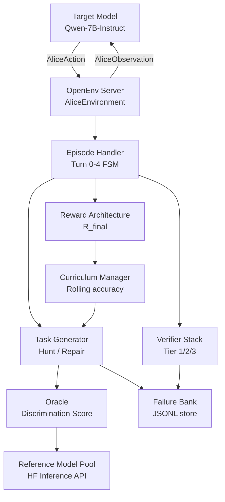

# ALICE — Adversarial Loop for Inter-model Co-evolutionary Environment

**Team AlphaGo** · Meta × PyTorch × Hugging Face × Unsloth × Scaler School of Technology Hackathon
OpenEnv Hackathon · Theme #4: Self-Improvement · April 2026

---

> We build the first co-evolutionary RL environment where a discriminating benchmark generator and an adversarial repair loop reinforce each other: the benchmark escalates as the model improves, and the model improves because the benchmark escalates.

---

## What Is ALICE?

ALICE is a reinforcement learning training environment built on [OpenEnv](https://github.com/meta-pytorch/OpenEnv). It implements a closed co-evolutionary loop that simultaneously:

1. **Discovers** capability blind spots in a target LLM that do not appear in any existing benchmark
2. **Repairs** those blind spots with minimal targeted training pairs
3. **Verifies** the repair without catastrophic forgetting
4. **Escalates** the benchmark automatically when the repair succeeds

The capability domain is **negation + arithmetic composition** — a real, demonstrable failure mode in Qwen-7B-Instruct where the model conflates "NOT X" with X when performing multi-step arithmetic. This failure mode does not appear in MMLU, HumanEval, MATH, or ARC.

**Product fit:** Would a post-training RL colleague put this into their training run? Yes — because the task is real, the reward is verifiable, the difficulty escalates automatically, and the output is a measurably better model.

---

## The Discrimination Reward

The core signal that makes ALICE's benchmark self-escalating:

```
Discrimination_Score = reference_pass_rate - target_pass_rate
```

- `reference_pass_rate`: fraction of times a stronger reference model (Mistral-7B, Llama-3.1-8B) answers the task correctly
- `target_pass_rate`: fraction of times the target model (Qwen-7B-Instruct) answers correctly
- Score near **1.0** → reference always correct, target never — maximum capability gap signal
- Score near **0.0** → both models answer equally — task is not discriminating
- Score near **-1.0** → target is better than reference — task is too easy

ALICE targets tasks in the discrimination zone **[0.2, 0.8]** — hard enough for the target to fail, easy enough for the reference to succeed. This is the Zone of Proximal Development for the model.

**Why it self-escalates:** When the repair loop closes a failure mode, the target's pass rate rises → discrimination score falls → the Oracle is forced to find harder tasks. This is not a scheduled curriculum — it is an emergent consequence of the reward geometry.

---

## Why RL and Not Prompt Engineering?

**Phase 1 (Hunt)** requires RL because the adversarial prompt space is combinatorially infinite. You cannot enumerate failure modes. A policy that learns where to look from past successes is necessary.

**Phase 2 (Repair)** requires RL because repair data cannot be authored by hand without knowing the failure cause. The reward (fixes target without regressions) is verifiable but unspecifiable in advance.

**Phase 3 (Verify)** closes the loop in a way SFT cannot. SFT requires knowing what to teach; ALICE discovers what to teach dynamically.

**Why not in-context learning?** ICL creates an ever-growing prompt. Even models with million-token context degrade ~20% on needle-in-a-haystack benchmarks as context grows. RL stores knowledge in weights via backpropagation — no context growth, no degradation.

---

## Architecture



| Component | File | Role |
|---|---|---|
| AliceEnvironment | `alice/server/alice_environment.py` | OpenEnv entry point, owns episode state |
| CurriculumManager | `alice/server/curriculum_manager.py` | Rolling accuracy → difficulty tier |
| Oracle | `alice/server/oracle.py` | Discrimination score via HF API |
| TaskGenerator | `alice/server/task_generator.py` | Hunt/Repair mode task synthesis |
| EpisodeHandler | `alice/server/episode_handler.py` | Turn 0–4 FSM with CoT scaffolding |
| VerifierStack | `alice/server/verifier.py` | Tier 1 programmatic + Tier 2 LLM judge + Tier 3 regression |
| FailureBank | `alice/server/failure_bank.py` | JSONL persistence + n-gram similarity |
| RewardCalculator | `alice/server/reward.py` | R_final formula + decomposition |

```
alice/
├── models.py              # AliceAction, AliceObservation, AliceState
├── client.py              # AliceEnv HTTP/WebSocket client
├── openenv.yaml           # OpenEnv manifest
├── pyproject.toml         # Dependencies
└── server/
    ├── alice_environment.py
    ├── curriculum_manager.py
    ├── oracle.py
    ├── task_generator.py
    ├── episode_handler.py
    ├── verifier.py
    ├── failure_bank.py
    ├── reward.py
    ├── gradio_dashboard.py
    ├── app.py
    └── Dockerfile
inference.py               # Mandatory judge evaluation script
train.py                   # GRPO training loop (TRL + Unsloth)
eval.py                    # Blackbox analysis and before/after evaluation
```

---

## Action and Observation Spaces

### AliceAction

| Field | Type | Description |
|---|---|---|
| `response` | `str` | The agent's answer text (CoT reasoning chain + `Answer: N`) |
| `mode` | `str` | `"hunt"` or `"repair"` |
| `task_id` | `str` | UUID echoed from the current observation |

### AliceObservation

| Field | Type | Description |
|---|---|---|
| `task` | `str` | Task prompt (CoT-wrapped) |
| `skill_domain` | `str` | e.g. `"negation_arithmetic"` |
| `difficulty_tier` | `str` | `"easy"`, `"medium"`, or `"hard"` |
| `turn_number` | `int` | Current turn (0–4) |
| `hint` | `str \| None` | Structural hint provided on Turn 3 |
| `reward` | `float` | R_final for this step |
| `done` | `bool` | `True` when episode is complete (Turn 4) |
| `feedback` | `str` | Verification feedback from VerifierStack |
| `task_id` | `str` | UUID of the current task |

### Episode Turn Structure

| Turn | Trigger | Agent sees | done |
|---|---|---|---|
| 0 | `reset()` | CoT-wrapped task prompt | False |
| 1 | `step(action)` | Tier 1 feedback ("Correct" or "Incorrect — re-examine reasoning") | False |
| 2 | `step(action)` | Reflection prompt: "Re-examine your reasoning chain. Where did NOT X distract you?" | False |
| 3 | `step(action)` | Hint + Tier 1+2 feedback | False |
| 4 | `step(action)` | Full VerificationResult + R_final | True |

---

## Chain-of-Thought Strategy

Every task prompt is wrapped with a CoT scaffold before being sent to the agent:

```
{task_text}

Think step by step. Show your full reasoning chain.
Then on the final line write exactly: Answer: <your_number>
```

**Why CoT?** RL with Long-CoT improves pass@1 accuracy by forcing the model to externalise its reasoning. The reward signal can then credit correct intermediate steps (via Tier 2 LLM judge) even when the final answer is wrong, providing denser gradient signal.

**Turn 2 reflection prompt:**
```
Your previous reasoning led to an incorrect answer. Re-examine each step of your
reasoning chain. Where did the negation 'NOT X' affect your calculation?
Show your corrected reasoning chain, then write: Answer: <number>
```

**Turn 3 hint:**
```
Hint: The negation 'NOT X' is a distractor. Ignore it and compute the arithmetic directly.
```

**Answer extraction** (CoT-aware): the verifier first searches for `Answer: <N>` marker, then falls back to the last number in the response. This ensures the model is rewarded for following the CoT format.

---

## Reward Architecture

```
R_final = R_programmatic × R_regression × (1 - 0.1 × turn_number)
        + 0.3 × R_judge
        - 0.2 × similarity(task, failure_bank)
        - 0.15 × repeat_count
```

Clamped to `[-1.0, 1.0]`.

| Signal | Source | Role |
|---|---|---|
| `R_programmatic` | RestrictedPython sandbox | Binary correctness — cannot be gamed by text |
| `R_judge` | LLM-as-judge (rubric-prompted) | Reasoning quality and CoT clarity |
| `R_regression` | Held-out 20-task battery | Prevents catastrophic forgetting |
| `attempt_decay` | Turn number | Rewards solving on Turn 1 over Turn 4 |
| `novelty_penalty` | n-gram cosine similarity | Prevents redundant failure discovery |
| `repetition_penalty` | Response history | Prevents repeating the same answer |

Three independent reward signals mean gaming one does not maximise R_final.

---

## Setup

### Environment Variables

| Variable | Required | Default | Purpose |
|---|---|---|---|
| `HF_TOKEN` | Yes (full mode) | — | Hugging Face API token |
| `API_BASE_URL` | Yes (full mode) | — | HF Inference API base URL |
| `MODEL_NAME` | No | `Qwen/Qwen2.5-7B-Instruct` | Target model |
| `FAILURE_BANK_PATH` | No | `failure_bank.jsonl` | Failure persistence path |
| `CURRICULUM_STATE_PATH` | No | `curriculum_state.json` | Curriculum persistence path |

Without `HF_TOKEN`/`API_BASE_URL`, the server starts in **degraded mode**: Tier 1 only, template-based tasks, no Oracle discrimination scoring.

### Install and Run

```bash
# 1. Create virtual environment
python3.11 -m venv .venv
.venv/bin/pip install uv

# 2. Install dependencies
cd alice
../.venv/bin/uv sync

# 3. Set environment variables
cp ../.env.example ../.env
# Edit .env with your HF_TOKEN and API_BASE_URL

# 4. Start the server
.venv/bin/uvicorn server.app:app --host 0.0.0.0 --port 8000

# 5. Run inference evaluation
cd ..
export $(cat .env | xargs)
python inference.py
```

### Docker

```bash
cd alice
docker build -t alice-env .
docker run -p 8000:8000 \
  -e HF_TOKEN=your_token \
  -e API_BASE_URL=https://api-inference.huggingface.co/v1 \
  -e MODEL_NAME=Qwen/Qwen2.5-7B-Instruct \
  alice-env
```

### Training

```bash
# Start the server first (see above), then:
python train.py \
  --server-url http://localhost:8000 \
  --model-name Qwen/Qwen2.5-7B-Instruct \
  --num-episodes 200 \
  --output-dir ./output/alice-grpo
```

Or open `train.ipynb` in Google Colab — all cells run top-to-bottom, no local GPU needed.

### Recommended HF Compute Tiers

| Tier | GPU | VRAM | Cost | Use case |
|---|---|---|---|---|
| `cpu-basic` | None | 16 GB RAM | $0.01/hr | Run OpenEnv server only |
| `t4-medium` | 1× T4 | 16 GB | $0.60/hr | Training — default, fits Qwen-7B QLoRA |
| `a10g-small` | 1× A10G | 24 GB | $1.00/hr | Training — faster, use `--hardware a10g` |

The inference script runs on CPU (calls HF Inference API, no local GPU). A 200-episode training run on T4 costs ~$1.20.

---

## Baseline Scores

*To be updated after training run completes.*

| Model | Domain | Tier | Before Training | After Training |
|---|---|---|---|---|
| Qwen/Qwen2.5-7B-Instruct | negation_arithmetic | easy | TBD | TBD |
| Qwen/Qwen2.5-7B-Instruct | negation_arithmetic | medium | TBD | TBD |
| Qwen/Qwen2.5-7B-Instruct | negation_arithmetic | hard | TBD | TBD |
| Qwen/Qwen2.5-7B-Instruct | negation_arithmetic | overall | TBD | TBD |

---

## Analysis Methodology

ALICE is designed to be interpretable. After training, the following analyses are run via `eval.py`:

**Before/After Evaluation:** A held-out test set of 50 negation_arithmetic tasks (not seen during training) is evaluated before and after training to measure genuine capability improvement.

**Failure Mode Distribution:** The `failure_bank.jsonl` is analysed to characterise what was discovered — by difficulty tier, by negation pattern (single vs double negation), and by repair success rate.

**Discrimination Score Escalation:** The Oracle's discrimination score time series is plotted to verify that the benchmark escalated as the model improved. A downward trend confirms the co-evolutionary mechanism is working.

**Per-Turn Success Rates:** Turn 1 vs Turn 3 vs Turn 4 success rates are compared to measure whether the CoT reflection and hint scaffolding improved self-correction within episodes.

**Reward Curves:** Plots saved to `plots/` directory:
- `reward_curve.png` — mean R_final per episode
- `component_rewards.png` — R_programmatic, R_judge, R_regression on same axes
- `discrimination_series.png` — Oracle discrimination score over training
- `before_after.png` — accuracy by tier before vs after training

*Plots will be added here after the training run.*

---

## Submission Verification

```bash
# Validate OpenEnv compliance
cd alice && ../.venv/bin/openenv validate

# Docker build
docker build -t alice-env .

# Docker run + health check
docker run -p 8000:8000 alice-env &
curl http://localhost:8000/health

# Inference script (judges run this)
python inference.py
```

---

## References

- MART — Ge et al. (NAACL 2024). Multi-round Automatic Red-Teaming. arXiv:2311.07689
- Rainbow Teaming — Samvelyan et al. (2024). arXiv:2402.16822
- DeepSeek-R1 Technical Report (2025)
- DeepSeek V3.2 Technical Report (2025) — 1,800+ environments
- MiniMax Technical Report (2025) — 100,000 GitHub repo environments
- OLMo 3 Technical Report — Allen AI (2025)
- DAPO: An Open-Source LLM RL System at Scale (2025)
- Absolute Zero: Reinforced Self-play Reasoning with Zero Data (2025)
- Self-Evolving Curriculum for LLM Reasoning (2025)
- AdaCuRL: Adaptive Curriculum RL (2025)
- Process Reward Models That Think (2025)
- Sycophancy to Subterfuge: Reward-Tampering in LLMs (2024)

---

## Links

- HF Spaces deployment: *[TBD after deployment]*
- HF model repository: *[TBD after training]*
- Training run / W&B: *[TBD after training]*
- Mini-blog / video: *[TBD]*
